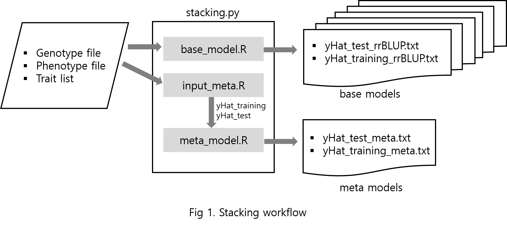

# Stacking: stacked generalization as a computational method for the genomic selection with Python and R
Sunhee Kim and Chang-Yong Lee

Stacking involves the integration of multiple models, called base models, along with an additional model, called the meta-model. The base models generate predictions for the data, and the meta-model is tasked with learning how to optimally combine these predictions to produce the final predictions. We selected six base models from the linear mixed and Bayesian models widely used in GS. To effectively combine the results of the base models, we used a neural network of a multi-layer perceptron as our meta-model. 

## Install prerequisites 
* Python : version 3.6 or later
* R : version 4 or later
* R-packages : rrBLUP, BGLR
* Python-packages : scikit-learn, scipy, tensorflow (version 2.2 or later), keras, numpy, pandas 

## Data sets
1.	preprocessed rice: genotype and phenotype data : https://github.com/infoLab204/stacking/blob/main/data/rice.tar.gz
2.	preprocessed barley : genotype and phenotype data : https://github.com/infoLab204/stacking/blob/main/data/barley.tar.gz
3.	preprocessed maize : genotype and phenotype data: https://github.com/infoLab204/stacking/blob/main/data/maize.tar.gz
4.	preprocessed mice : genotype and phenotype data : https://github.com/infoLab204/stacking/blob/main/data/mice.tar.gz
5. The original data of the four species
    * Rice :  http://www.ricediversity.org/data/sets/44kgwas/ 
    * Barley : https://journals.plos.org/plosone/article?id=10.1371/journal.pone.0164494#sec019
    * Mazie : https://www.panzea.org/data
    * Mice : In the installed R-packages BGLR

## Python and R scripts tutorial

1.	Download the script from the GitHub repository
    |Script|Explain|
  	 |---|---|
  	 |stacking.py| main function|
  	 |base_model.R| phenotype prediction of each base model|
  	 |input_meta.R| generate input for meta-model using base model|
  	 |meta_model.py| phenotype prediction of met-model|
  	 |analysis.R| evaluate MSE, overfitting, correlation|
  	 |hypothesis_tests.R| Non-inferiority test|

2.	Python scripts for predictions using base model and meta-model    
    **Input**: genotype data, phenotype data, and phenotype name    
    **Usage** : python stacking.py genotype phenotype phenotype_name
  	
  	 (ex) Phenotype SSW in barley       
            python stacking.py genotype_barley.txt phenotype_barley.txt SSW    

    **Output** : predicted phenotypes using test and training data with each model    
       * y_test_rrBLUP.txt　　y_training_rrBLUP.txt    
       * y_test_gBLUPP.txt　　y_training_gBLUP.txt    
       * y_test_BA.txt　　　　y_training_BA.txt    
       * y_test_BB.txt　　　　y_training_BB.txt    
       * y_test_BC.txt　　　　y_training_BC.txt    
       * y_test_BL.txt　　　　y_training_BL.txt    
       * y_test_meta.txt　　　y_training_meta.txt    

   
3.	Analysis of results: mean squared error, overfitting, correlation coefficient    
**Input**: predicted phenotypes using base and meta models    
**Usage**: Rscript analysis.R   
**Output**: mse_test.txt　　mse_train.txt　　overfitting.txt　　correlation.txt    

4.	Non-inferiority test results    
**Input**: predicted phenotypes using base and meta models    
**Usage**: Rscript hypothesis_tests.R    
**Output**: power.txt　　sampe_size.txt　　margin.txt　　p_value.txt    

